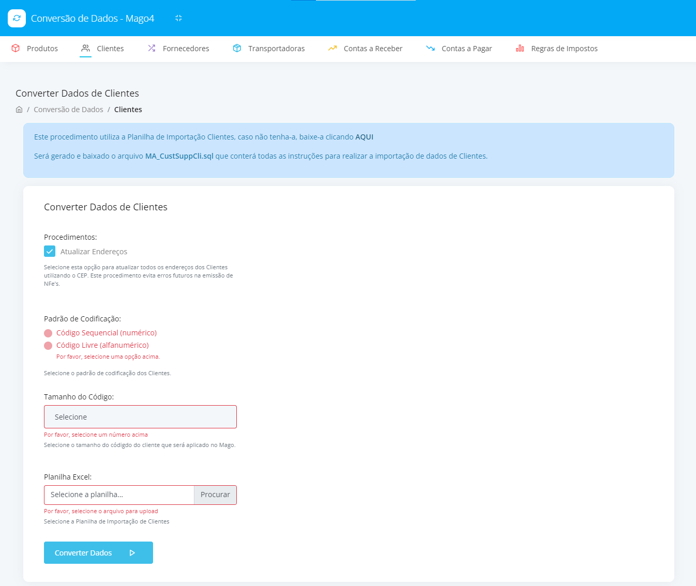

# Excel to SQL (Em desenvolvimento)
## Aplicação de Conversão de Dados de Entidades de Excel para Instruções SQL
Esta aplicação tem como objetivo principal transformar dados disponibilizados em planilha (cadastros de clientes, fornecedores, produtos, etc) em instruções SQL (Insert e Update) visando a estrutura de banco de dados de uma aplicação específica. Porém, este código poderá ser utilizado para exemplo e uso em outras estruturas de bancos de dados.

### Tecnologias utizadas neste projeto:
- Javascript
- CSS3
- HTML5
- Electron.js

### Versão Atual 1.0.0:
